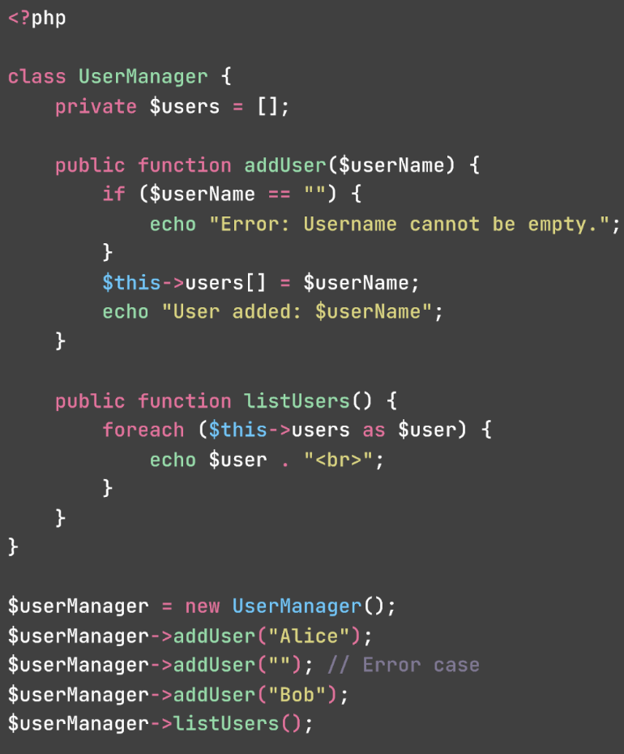
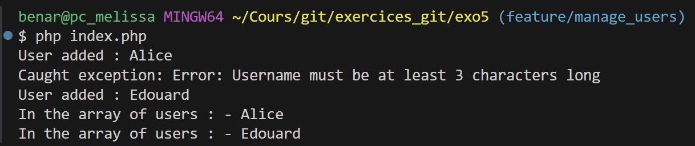
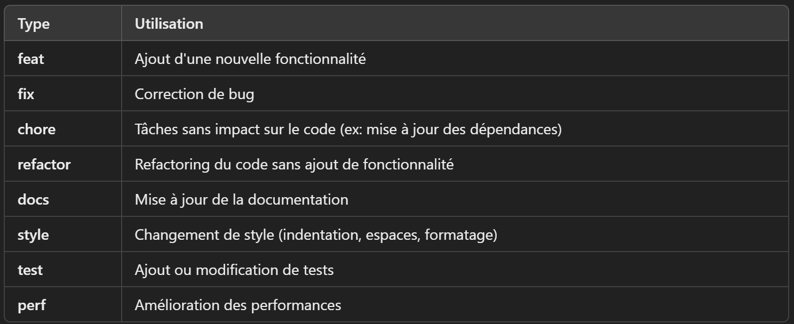

# EXERCICE 5 

Revoir une Pull Request

### 1. Crée une nouvelle PR

### 2. Ajoute le code suivant : 


### 3. Examine les modifications ligne par ligne, en vérifiant la logique, la lisibilité, et la conformité aux bonnes pratiques

### 4. Laisse des commentaires pour suggérer des améliorations ou poser des questions:
`voir GitHub`

### 5. Une fois que les commentaires ont été pris en compte, approuve la PR et fusionne-la
`Merge Pull Request`




----------------------


# Exercice 6 

Rédiger des messages de commit conformes aux conventions


## 1. Dans un projet Git, fais une série de petites modifications (ajout de fichiers, correction de bugs, modifications de style)

- New branch `feature/home` : `Add index.php`


## 2. Commits les modifications en utilisant des messages de commit conformes aux conventions Angular ou Git Conventional Commits

`git commit -m "feat: Add basic user management example in index.php"`


## 3. Inclue des types comme feat, fix, chore, et rédige des messages descriptifs

- types de commit selon la convention Angular: 



## 4. Valide que les messages de commit sont cohérents et faciles à comprendre:


-----

# EXERCICE 7 

Utiliser commitlint pour vérifier les messages de commit


## 1.Installe commitlint dans un projet existant

- Install [commitlint](https://commitlint.js.org/guides/getting-started.html):
`npm install --save-dev @commitlint/{cli,config-conventional}`

- Create commitlint.config.js :
`module.exports = { extends: ['@commitlint/config-conventional'] };`

- To check the latest commit, run : 
`npx commitlint --from=HEAD~1 --to=HEAD`


## 2.Configure commitlint pour utiliser les conventions Angular

## 3.Effectue quelques commits en utilisant des messages conformes et non conformes pour observer les vérifications de commitlint.

Corrige les messages de commit non conformes pour qu'ils respectent les conventions.

## 4. Installer Husky pour valider les commits automatiquement 

- Install : `npm install --save-dev husky`
- Activate : `npx husky-init` 
- Create a file for messages: `touch .husky/commit-msg`
- Add Commitlint command : 
```
#! /bin/sh
. "$(dirname -- "$0")/_/husky.sh"

npx --no -- commitlint --edit $1
```

Husky exécute Commitlint chaque fois qu'un message de commit est fait en passant l'argument $1 qui représente le message du commit

